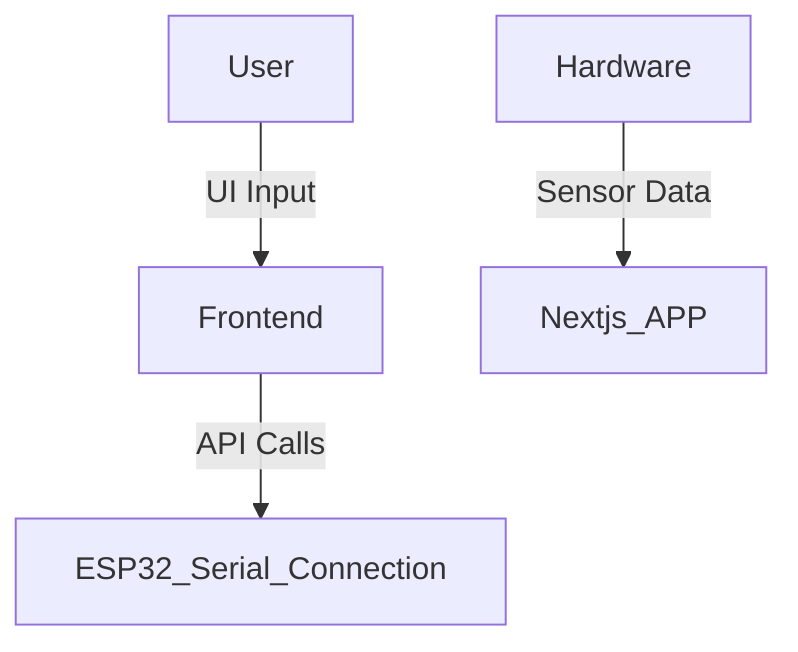

# 🚀 Project Title: IoT-Based Automatic Animal Door System

## 📌 Overview
The IoT-Based Automatic Animal Door System automates pet or livestock door access using sensors and smart controls. It ensures secure, scheduled, or sensor-based entry and exit without human intervention.

## 🧠 Key Features
- ✅ Real-time tracking , smart control
- ✅ Web App Integration / IoT Support
- ✅ Admin Dashboard / Analytics Dash
- ✅ User Friendly 

## 🛠️ Technologies Used

### 💻 Frontend


### ⚙️ Hardware


## 🧩 Available Platforms
- 🌐 Web
- 🚀 Embedded (ESP32)

## ⚙️ System Architecture
> _There is no backend. I am directly connecting the ESP32 serial communication to the Next app to transfer the commands._


## 📸 Screenshots / Demo

| Dashboard | Hardware Setup |
|-----------|----------------|
| 

 | |


## 📱 Installation & Setup

### Prerequisites
- [ ] Node.js 
- [ ] ESP32
- [ ] Visual Studio Code

### Setup Steps
```bash
# Clone the repository
git clone https://github.com/Raghavan2005/IoT-Based-Automatic-Animal-Door-System.git
cd IoT-Based-Automatic-Animal-Door-System

# Install dependencies
npm install         # For Node.js backend
npm run dev         # To Run the Project
```


## 📄 License
This project is licensed under the [MIT License](LICENSE).

